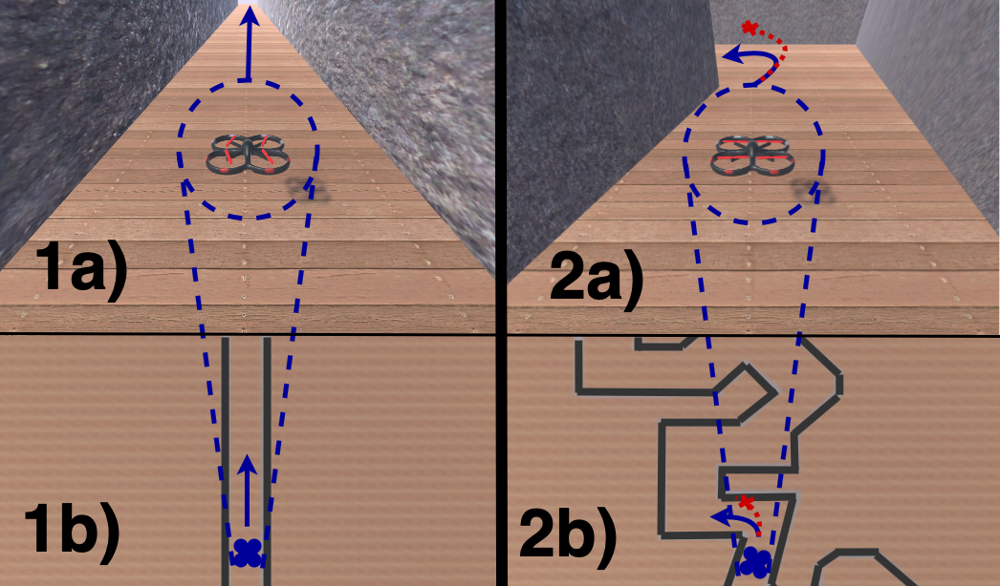

# Overview

Executing a standard test set for mobile robots is common to validate that the robot works correctly. However, these standard tests overlook faults that may arise when the robot is stressed. Creating stressful tests is difficult as each robot is different and has different physical capabilities. We provide a tool that using the kinematic and dynamic model of a robot as well as a parameterisable scoring model can stress robots. Using this, we can generate tests that are both feasible as well as stressful. This tool comes with code which can be used to generate these trajectories, a drone simulation called World Engine built using [Unity](https://unity.com) as well as [FlightGoggles](https://flightgoggles.mit.edu), the code used to fly the Anafi drone, as well as the code used to process the data. So, for example, in 1 we can see the drone doing a standard test of flying. In 2 we can see that the drone needs to make complex turns in order to reach a goal.

# Getting Started

Getting started is easy. Take a look at any of the following:
